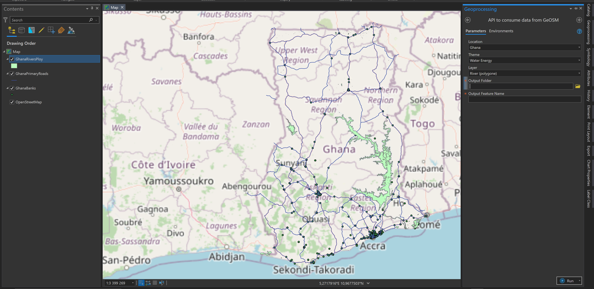

# GeSOM4ArcGIS
GeOSM is a geospatial data infrastructure based on openstreetmap data.
The aim of this script tool is to consume data from the GeOSM API direcly into ArcGIS Pro.

Link to the API documentation : api.geosm.org
Link to presentation video : https://youtu.be/CyjUxU_jM_w
